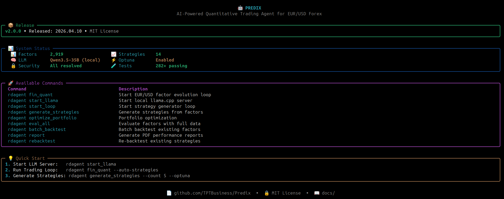

# NexQuant

<p align="center">
  
  
  
  
</p>

<p align="center">
  
  
  
  
</p>

<h4 align="center">
  <strong>AI-powered Quantitative Trading Agent for EUR/USD Forex</strong>
</h4>

<p align="center">
  <a href="#installation">Installation</a> •
  <a href="#no-gpu-use-openrouter">No GPU?</a> •
  <a href="#quick-start">Quick Start</a> •
  <a href="#configuration">Configuration</a> •
  <a href="#features">Features</a>
</p>

<p align="center">
  <a href="https://github.com/TPTBusiness/NexQuant/actions/workflows/ci.yml">
    
  </a>
  <a href="https://github.com/TPTBusiness/NexQuant/actions/workflows/codacy.yml">
    
  </a>
  <a href="https://codecov.io/gh/TPTBusiness/NexQuant">
    
  </a>
  <a href="https://github.com/TPTBusiness/NexQuant/blob/master/LICENSE">
    
  </a>
  <a href="https://www.conventionalcommits.org/">
    
  </a>
  <a href="https://github.com/astral-sh/ruff">
    
  </a>
  <a href="https://github.com/TPTBusiness/NexQuant/stargazers">
    
  </a>
  <a href="https://github.com/TPTBusiness/NexQuant/forks">
    
  </a>
  <a href="https://github.com/TPTBusiness/NexQuant/issues">
    
  </a>
  <a href="https://github.com/TPTBusiness/NexQuant/commits/master">
    
  </a>
</p>

---

## 🖥️ CLI Dashboard

```bash
rdagent nexquant
```



*The NexQuant CLI shows system status, available commands, and quick start guide.*

---

## Overview

**NexQuant** is an autonomous AI agent for quantitative trading strategies in the EUR/USD forex market. Built on a multi-agent framework, NexQuant automates the full research and development cycle:

- 📊 **Factor Generation** — LLM proposes novel alpha factors; Kronos foundation model generates OHLCV-based predictions
- 💡 **Strategy Discovery** — Autopilot generates + backtests trading strategies 24/7
- 🧠 **Model Evolution** — CoSTEER iteratively improves predictive models through code evolution
- 📈 **Backtesting** — Unified engine with 10 runtime invariants on 1-min EUR/USD data (2020–2026)
- 🔄 **Auto-Restart** — All services run as daemons with automatic crash recovery

NexQuant is optimized for **1-minute EUR/USD FX data** (2020–2026) and supports both local LLMs (llama.cpp) and cloud backends (OpenRouter).

> **Backtest Verification**: Every backtest result is automatically verified at runtime against mathematical invariants (MaxDD ∈ [-1,0], WinRate ∈ [0,1], Sharpe finite, sign consistency, etc.). 1125 collected tests with deep property-based, fuzzing, and hypothesis tests ensure metric correctness. See [Backtest Integrity](#backtest-integrity).

## Acknowledgments

This project draws inspiration from various open-source projects in the AI trading and multi-agent systems space. We thank all the authors for their innovative work that helped shape our understanding of these patterns.

Special thanks to:

- **[Microsoft RD-Agent](https://github.com/microsoft/RD-Agent)** (MIT License) - Foundation for our autonomous R&D agent framework. We extend our gratitude to the RD-Agent team for their excellent foundational work.

- **[TradingAgents](https://github.com/TauricResearch/TradingAgents)** (Apache 2.0 License) - Inspiration for our multi-agent debate system, reflection mechanism, and memory management modules.

- **[ai-hedge-fund](https://github.com/virattt/ai-hedge-fund)** - Inspiration for macro analysis (Stanley Druckenmiller agent), risk management concepts, and market regime detection.

All code in NexQuant is originally written and implemented independently. NexQuant extends these frameworks with EUR/USD forex-specific features, 1-minute backtesting capabilities, comprehensive risk management, and trading dashboards.

---

## Installation

### System Requirements

| Component | Minimum | Recommended |
|-----------|---------|-------------|
| **GPU VRAM** | 8 GB | 16 GB (RTX 4080 / 5060 Ti) |
| **RAM** | 16 GB | 32 GB |
| **Storage** | 20 GB | 50 GB (models + data) |
| **OS** | Linux (Ubuntu 22.04+) | Linux |
| **CUDA** | 12.0+ | 12.4+ |

> Local LLMs require a CUDA-capable GPU. The default model (Qwen3.6-35B Q3) uses ~13.6 GB VRAM. CPU-only inference is possible but very slow (not recommended for production use).

### Prerequisites

- **Conda** (Miniconda or Anaconda) — required for environment management
- **Docker** — required for sandboxed factor/model code execution (`docker run hello-world` to verify)
- **llama.cpp** — for local LLM inference (see [llama.cpp build guide](https://github.com/ggml-org/llama.cpp))
- **Ollama** — for embeddings (`nomic-embed-text`); install from [ollama.com](https://ollama.com) and run `ollama pull nomic-embed-text`
- **Linux** — officially supported; macOS/Windows may work with adjustments

### Quick Install

```bash
# Clone repository
git clone https://github.com/TPTBusiness/NexQuant
cd NexQuant

# Create and activate conda environment
conda create -n nexquant python=3.10 -y
conda activate nexquant

# Install in editable mode
pip install -e .

# Verify Docker is accessible
docker run --rm hello-world
```

> **Important:** NexQuant requires a conda environment to manage dependencies properly.
> Using plain Python or other environment managers may cause conflicts.

---

## Data Setup

NexQuant requires **1-minute EUR/USD OHLCV data** in HDF5 format. This is a hard prerequisite — the system cannot run without it.

### Step 1: Get the data

Download 1-minute EUR/USD data (2020–present) from any of these free sources:

| Source | Cost | Notes |
|--------|------|-------|
| **[Dukascopy](https://www.dukascopy.com/swiss/english/marketfeed/historical/)** | Free | Best quality free EUR/USD tick data |
| **[OANDA API](https://developer.oanda.com/)** | Free (demo) | Requires API key, programmatic access |
| **[TrueFX](https://truefx.com/)** | Free | Institutional-quality tick data |
| **[Kaggle](https://www.kaggle.com/datasets?search=EURUSD+1min)** | Free | Search "EURUSD 1 minute" |
| **MetaTrader 5** | Free | Export via `copy_rates_range()` |

### Step 2: Convert to HDF5

```python
import pandas as pd

df = pd.read_csv('eurusd_1min.csv', parse_dates=['datetime'])
df = df.rename(columns={'open': '$open', 'close': '$close',
                        'high': '$high', 'low': '$low', 'volume': '$volume'})
df['instrument'] = 'EURUSD'
df = df.set_index(['datetime', 'instrument'])
for col in ['$open', '$close', '$high', '$low', '$volume']:
    df[col] = df[col].astype('float32')

import os
os.makedirs('git_ignore_folder/factor_implementation_source_data', exist_ok=True)
df.to_hdf('git_ignore_folder/factor_implementation_source_data/intraday_pv.h5', key='data', mode='w')
```

### Required HDF5 format

| Field | Type | Description |
|-------|------|-------------|
| **Index** | MultiIndex `(datetime, instrument)` | Timestamp + currency pair |
| **`$open`** | float32 | Open price |
| **`$close`** | float32 | Close price |
| **`$high`** | float32 | High price |
| **`$low`** | float32 | Low price |
| **`$volume`** | float32 | Tick volume |

**Save location:** `git_ignore_folder/factor_implementation_source_data/intraday_pv.h5`

---

## Configuration

### Environment Setup

Create a `.env` file in the project root:

```bash
# Local LLM (llama.cpp)
OPENAI_API_KEY=local
OPENAI_API_BASE=http://localhost:8081/v1
CHAT_MODEL=qwen3.5-35b

# Embedding (Ollama)
LITELLM_PROXY_API_KEY=local
LITELLM_PROXY_API_BASE=http://localhost:11434/v1
EMBEDDING_MODEL=nomic-embed-text

# Paths
QLIB_DATA_DIR=~/.qlib/qlib_data/eurusd_1min_data
```

### LLM Server (llama.cpp)

```bash
~/llama.cpp/build/bin/llama-server \
  --model ~/models/qwen3.6/Qwen3.6-35B-A3B-UD-Q3_K_XL.gguf \
  --n-gpu-layers 18 \
  --no-mmap \
  --port 8081 \
  --ctx-size 260000 \
  --parallel 2 \
  --batch-size 512 --ubatch-size 512 \
  --host 0.0.0.0 \
  -ctk q4_0 -ctv q4_0 \
  --reasoning off
```

> **Important flags:**
> - `--ctx-size 260000 --parallel 2` — allocates **2 slots × 130,000 tokens each**.
> - `--reasoning off` — **critical**: completely disables Qwen3 chain-of-thought. `--reasoning-budget 0` is not sufficient and produces empty JSON responses.
> - `--n-gpu-layers 18` — reduced from max (33) to free ~7 GB VRAM for Kronos-small GPU inference alongside llama-server.
> - `-ctk q4_0 -ctv q4_0` — quantises the KV cache to 4-bit, reducing VRAM usage.

### Data Configuration

Edit [`data_config.yaml`](data_config.yaml) to customize walk-forward splits:

```yaml
instrument: EURUSD
frequency: 1min
data_path: ~/.qlib/qlib_data/eurusd_1min_data

train_start: "2022-03-14"
train_end:   "2024-06-30"
valid_start: "2024-07-01"
valid_end:   "2024-12-31"
test_start:  "2025-01-01"
test_end:    "2026-03-20"

market_context:
  spread_bps: 1.5
  target_arr: 9.62
  max_drawdown: 20
```

---

## No GPU? Use OpenRouter

If you don't have a CUDA-capable GPU, you can run NexQuant using [OpenRouter](https://openrouter.ai) for LLM inference — no local model download required.

**1. Set up `.env` for OpenRouter:**

```bash
# Chat (OpenRouter)
OPENAI_API_KEY=sk-or-v1-<your-openrouter-key>
OPENAI_API_BASE=https://openrouter.ai/api/v1
CHAT_MODEL=qwen/qwen3-235b-a22b

# Embedding (Ollama — still required locally)
LITELLM_PROXY_API_KEY=local
LITELLM_PROXY_API_BASE=http://localhost:11434/v1
EMBEDDING_MODEL=nomic-embed-text
```

**2. Skip the llama-server step** — no local LLM server needed.

**3. Run with the OpenRouter backend:**

```bash
rdagent fin_quant --model openrouter
```

**4. Parallel runs** (uses API concurrency instead of GPU slots):

```bash
python scripts/nexquant_parallel.py --runs 5 --api-keys 1 -m openrouter
```

> Ollama is still required for embeddings even in the OpenRouter path. Install from [ollama.com](https://ollama.com) and run `ollama pull nomic-embed-text` once.

---

## Quick Start

### Prerequisites checklist

```bash
# 1. Docker running?
docker run --rm hello-world

# 2. Data in place?
ls git_ignore_folder/factor_implementation_source_data/intraday_pv.h5

# 3. LLM server running?
curl http://localhost:8081/health
```

### 1. Run Trading Loop

```bash
conda activate nexquant
rdagent fin_quant
# or with explicit options:
rdagent fin_quant --loop-n 5 --step-n 2
```

### 2. Monitor Results

```bash
# Web dashboard
rdagent server_ui --port 19899 --log-dir git_ignore_folder/RD-Agent_workspace/
# then open http://127.0.0.1:19899

# Best strategies so far
python nexquant.py best
```

### 3. Run Continuously (Auto-Restart)

```bash
# Start all services with auto-restart daemons:

# fin_quant — factor R&D loop
nohup bash -c 'while true; do rdagent fin_quant --loop-n 10 --model local >> /tmp/fin_quant_daemon.log 2>&1; sleep 10; done' &

# Autopilot — 24/7 strategy generator (Kronos factors auto-selected)
nohup python scripts/nexquant_autopilot.py >> /tmp/autopilot_daemon.log 2>&1 &

# Live Trader — FTMO FIX API (requires credentials)
nohup python git_ignore_folder/live_trading/ftmo_live_trader.py >> ftmo_live_trader.log 2>&1 &
```

---

## CLI Commands

### Factor & Strategy Loop

| Command | Description |
|---------|-------------|
| `rdagent fin_quant` | Start autonomous factor + model evolution loop |
| `rdagent fin_quant --loop-n 5` | Run exactly 5 evolution loops |
| `rdagent fin_quant --with-dashboard` | Start with web dashboard |
| `rdagent fin_quant --cli-dashboard` | Start with CLI Rich dashboard |
| `rdagent fin_factor` | Factor-only evolution |
| `rdagent fin_model` | Model-only evolution |

### Strategy Reports

| Command | Description |
|---------|-------------|
| `python nexquant.py best` | Show top strategies by composite score |
| `python nexquant.py best -n 20 -m sharpe` | Top 20 by Sharpe ratio |
| `python nexquant.py best --show NAME` | Full metadata for one strategy |
| `python scripts/nexquant_gen_strategies_real_bt.py 10` | Generate 10 strategies with LLM + real OHLCV backtest |
| `python scripts/nexquant_gen_strategies_real_bt.py 20` | Generate 20 strategies (parallel workers) |
| `python scripts/nexquant_autopilot.py` | 24/7 Auto-Pilot: endless strategy generation |
| `python scripts/nexquant_continuous_strategies.py` | Continuous generation with ML training

### Kronos Foundation Model

| Command | Description |
|---------|-------------|
| `rdagent fin_quant` | Kronos factors auto-generated on startup (3 horizons) |
| Model size: `KRONOS_MODEL_SIZE=small\|mini\|base` | Configurable via env (default: small) |

Kronos runs automatically — no separate command needed. Factors are regenerated if missing from `results/factors/`.

### Factor Evaluation

| Command | Description |
|---------|-------------|
| `python nexquant.py evaluate --all` | Evaluate all generated factors |
| `python nexquant.py top -n 20` | Show top 20 factors by IC |
| `python nexquant.py portfolio-simple` | Simple portfolio optimization |

### Parallel Execution

| Command | Description |
|---------|-------------|
| `python scripts/nexquant_parallel.py --runs 5 --api-keys 1 -m openrouter` | Run 5 parallel factor evolutions |
| `python scripts/nexquant_parallel.py --runs 20 --api-keys 2 -m openrouter` | Run 20 runs with 2 API keys |

### Monitoring & Debug

| Command | Description |
|---------|-------------|
| `rdagent server_ui --port 19899 --log-dir <path>` | Start web dashboard |
| `rdagent health_check` | Validate environment setup |
| `python scripts/nexquant_batch_backtest.py` | Batch backtest multiple factors |
| `python scripts/nexquant_rebacktest_strategies.py` | Re-backtest existing strategies |

---

## Features

### 🔄 Iterative Factor Evolution

NexQuant continuously proposes, implements, and validates new alpha factors:

- Learns from backtest feedback
- Avoids overfitting through walk-forward validation
- Discovers non-obvious patterns in order flow, volatility, and session dynamics

### 🛡️ Trading Protection System

Automatic risk management to prevent excessive losses:

- **Max Drawdown Protection** - Pauses trading when drawdown exceeds threshold (default: 15%)
- **Cooldown Period** - Enforces mandatory rest period after significant losses (default: 4h after 5% loss)
- **Stoploss Guard** - Detects clusters of stoplosses and blocks trading (default: max 5 per day)
- **Low Performance Filter** - Filters out consistently underperforming factors (Sharpe < 0.5, Win Rate < 40%)

### 🧠 Model Architecture Search

Automatically explores and refines predictive models:

- Linear baselines (LightGBM, XGBoost)
- Deep learning (LSTM, Transformer, Temporal CNN)
- Ensemble methods

### 📚 Knowledge Base

Built-in knowledge accumulation across loops:

- Successful factors are archived
- Failed attempts inform future proposals
- Cross-loop learning improves robustness

### 🖥️ Interactive UI

Real-time dashboard for monitoring:

- Factor performance metrics
- Model architecture evolution
- Cumulative returns and drawdowns
- Code diffs and implementation history

### 🤖 Kronos Foundation Model Integration

NexQuant integrates Kronos — an OHLCV foundation model from the NeoQuasar team (AAAI 2026, **MIT License**) — for alpha factor generation:

| Model | Params | p24 IC | Best For |
|-------|--------|--------|----------|
| **Kronos-small** (default) | 25M | \|IC\| ≈ 0.09 | 1-min EUR/USD |
| Kronos-mini | 4.1M | \|IC\| ≈ 0.07 | Low-resource |
| Kronos-base | 102M | \|IC\| ≈ 0.002 | Daily/weekly data only |

Kronos generates 3 prediction-horizon factors automatically on `fin_quant` startup:
- `KronosPredReturn_p24` — 24-minute horizon
- `KronosPredReturn_p48` — 48-minute horizon  
- `KronosPredReturn_p96` — 96-minute horizon (best performer)

The model runs on GPU (CUDA) alongside the llama-server, using CPU as fallback.
Factors are persisted in `results/factors/` for use by the strategy orchestrator.

```bash
# Kronos runs automatically with fin_quant (no separate command needed)
rdagent fin_quant --loop-n 10 --model local

# Model size is auto-detected and configurable via env
# Set KRONOS_MODEL_SIZE=base to use the 102M-param model
```

### 🔒 Security & Quality

Automated quality assurance:

- **1,125+ collected tests** — deep property-based, fuzzing, and hypothesis tests on every commit
- **Bandit Security Scanner** — pre-commit security checks
- **Weekly Dependency Audit** — automated vulnerability scan via GitHub Actions
- **Closed-source detection** — CI verifies no local/ files are accidentally committed

---

## Project Structure

```
nexquant/
├── rdagent/                 # Core agent framework
│   ├── app/                 # CLI and scenario apps
│   │   └── qlib_rd_loop/    # Quant R&D loop (factor + model generation)
│   ├── components/          # Reusable agent components
│   │   ├── backtesting/     # Backtest engine & protections
│   │   │   ├── vbt_backtest.py  # Unified backtest engine (1-min bars)
│   │   │   ├── verify.py        # Runtime backtest invariant checker
│   │   │   ├── results_db.py
│   │   │   └── protections/     # Trading protection system
│   │   ├── coder/           # Factor & model coding
│   │   │   ├── CoSTEER/     # LLM-based code evolution engine
│   │   │   ├── factor_coder/  # Factor-specific coders
│   │   │   ├── model_coder/   # Model-specific coders
│   │   │   └── kronos_adapter.py  # Kronos foundation model adapter
│   │   └── workflow/        # R&D loop workflow
│   ├── core/                # Core abstractions
│   ├── oai/                 # LLM backend (LiteLLM, streaming, retry)
│   ├── log/                 # Logging infrastructure
│   ├── scenarios/           # Domain-specific scenarios (qlib, kaggle, rl)
│   └── utils/               # Utilities
├── scripts/                 # Daily operation scripts
│   ├── nexquant_autopilot.py          # 24/7 auto strategy generator
│   ├── nexquant_gen_strategies_real_bt.py  # Parallel strategy generation
│   ├── nexquant_parallel.py           # Multi-instance parallel R&D
│   ├── nexquant_continuous_strategies.py  # Continuous strategy generation
│   ├── nexquant_fast_rebacktest.py    # Fast strategy re-evaluation
│   └── nexquant_rebacktest_parent.py  # Parallel rebacktest orchestrator
├── test/                    # Test suite (1,125+ collected)
│   ├── backtesting/         # Backtest engine deep tests
│   ├── qlib/                # Quant loop, factor, model tests
│   ├── oai/                 # LLM backend tests
│   ├── log/                 # Logger tests
│   ├── local/               # Closed-source tests (autopilot, ML, strategies)
│   └── integration/         # End-to-end pipeline tests
├── data_config.yaml         # Walk-forward split configuration
├── pyproject.toml           # Project metadata
├── requirements.txt         # Dependencies
└── AGENTS.md               # Agent configuration & workflow guide
```

---

## Requirements

Core dependencies (see [`requirements.txt`](requirements.txt) for full list):

- **LLM**: `openai`, `litellm`
- **Data**: `pandas`, `numpy`, `pyarrow`
- **ML**: `scikit-learn`, `lightgbm`, `xgboost`
- **Backtesting**: `qlib` (via Docker)
- **UI**: `streamlit`, `plotly`, `flask`

---

## License

This project is licensed under the **GNU Affero General Public License v3.0 (AGPL-3.0)**.

Key points of AGPL-3.0:
- You may use, modify, and distribute this software freely
- If you distribute modified versions, you MUST publish your changes under the same AGPL-3.0 license
- If you run this software as a network service (e.g., trading API), you MUST make the complete source code available to users
- Includes patent protection and anti-tivoization clauses

See the full license text in [`LICENSE`](LICENSE) or at <https://www.gnu.org/licenses/agpl-3.0.en.html>.

---

## Contributing

Contributions are welcome! Please:

1. Fork the repository
2. Create a feature branch (`git checkout -b feat/my-feature`)
3. Commit using [Conventional Commits](https://www.conventionalcommits.org/) (`git commit -m 'feat: add my feature'`)
4. Push to the branch (`git push origin feat/my-feature`)
5. Open a Pull Request with a conventional commit title

For major changes, please open an issue first to discuss your approach.

---

## Citation

If you use NexQuant in your research, please cite the underlying framework:

```bibtex
@misc{yang2025rdagentllmagentframeworkautonomous,
  title={R&D-Agent: An LLM-Agent Framework Towards Autonomous Data Science},
  author={Yang, Xu and Yang, Xiao and Fang, Shikai and Zhang, Yifei and Wang, Jian and Xian, Bowen and Li, Qizheng and Li, Jingyuan and Xu, Minrui and Li, Yuante and others},
  year={2025},
  eprint={2505.14738},
  archivePrefix={arXiv},
  primaryClass={cs.AI}
}
```

---

## Support

- **Issues**: [GitHub Issues](https://github.com/TPTBusiness/NexQuant/issues)

---

## Backtest Integrity

Every backtest result is automatically verified at runtime against 10 mathematical invariants.  
The verifier runs in **<1ms** and catches corrupted/missing/flipped metrics before they enter the factor database.

### Runtime checks (every backtest)
| Check | Constraint |
|-------|-----------|
| Max Drawdown | `-1.0 ≤ mdd ≤ 0.0` |
| Win Rate | `0.0 ≤ wr ≤ 1.0` |
| Sharpe Ratio | `sharpe` must be finite |
| Total Return | `total_return` must be finite |
| Trade Count | `n_trades ≥ 0` |
| Sign consistency | `sign(sharpe) == sign(annual_return)` |
| Status | Must be `success` or `failed` |

### Test suite (CI + pre-commit)
```bash
pytest test/ -q        # 1,125+ collected, property-based + fuzzing
pytest test/backtesting/ -q # backtest engine deep tests
```

**Coverage**: IC linear invariance, forward-return alignment, cross-implementation validation, ground-truth hand-computed scenarios, look-ahead bias detection, edge cases (all-NaN, constant, zero-variance, 1-bar, empty series), Monte Carlo p-value, walk-forward rolling, buy-and-hold equality, property-based testing (hypothesis: cost monotonicity, signal inversion, max-DD invariants), fuzzing (1,000 random backtest results), autopilot failure recovery, threshold rescaling, API key distribution, ML model acceptance criteria.

---

## Disclaimer

NexQuant is provided "as is" for **research and educational purposes only**. It is **not** intended for:

- Live trading or financial advice
- Production use without thorough testing
- Replacement of qualified financial professionals

Users assume all liability and should comply with applicable laws and regulations in their jurisdiction. Past performance does not guarantee future results.
